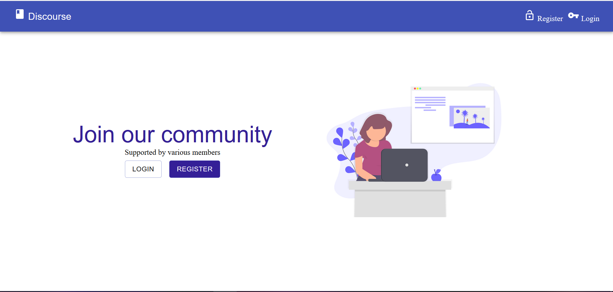
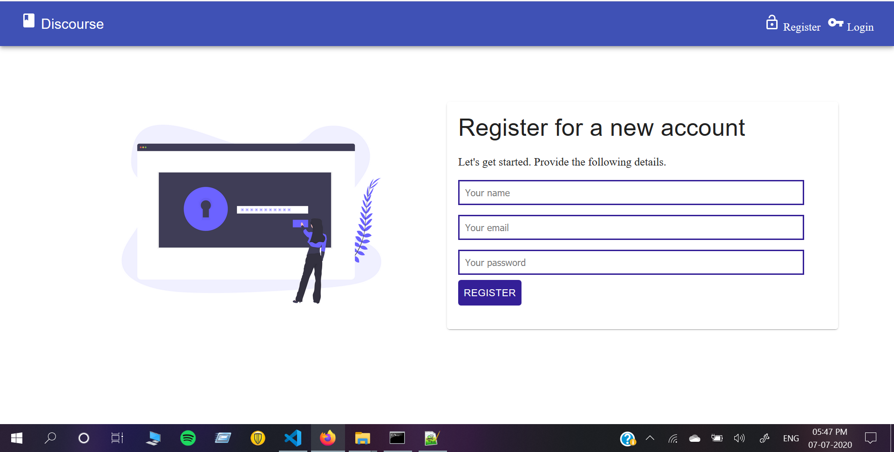
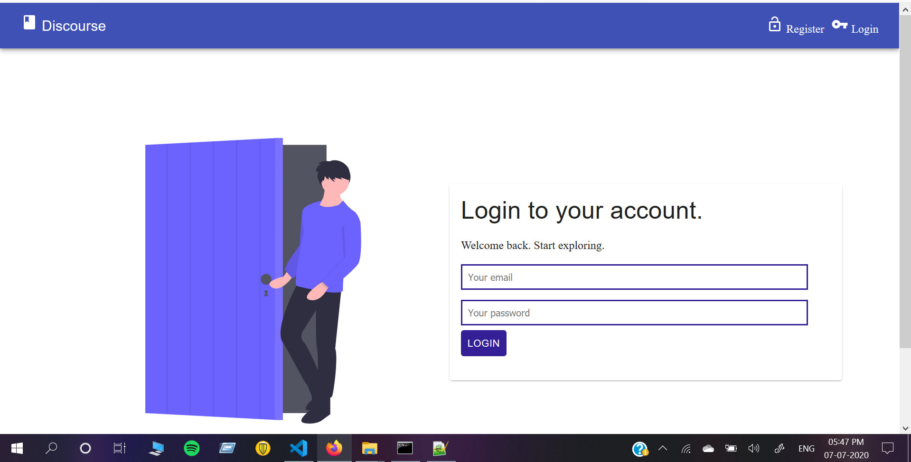
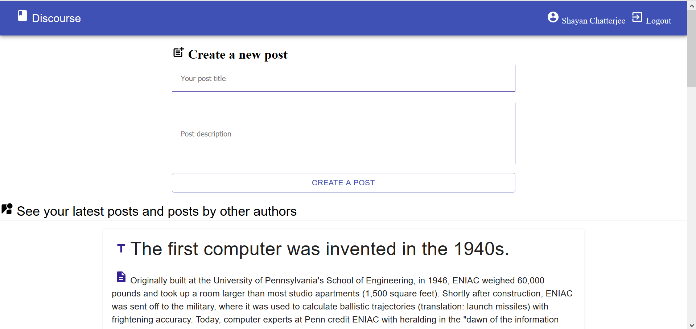

# Discourse - A web application

# Snapshots of the project

# Pre-requisites

    1. Must have NodeJS installed in your system.

# How to run in local machine?

1. Clone the repository and navigate to the folder.
2. To install the dependencies of the server run -> `npm install`
3. Navigate to client folder by -> `cd client`.
4. Install the client dependencies by -> `npm install`
5. Back to root folder by -> `cd ..`
6. Run `npm run dev` to start the server and client concurrently.
7. Go to `localhost:3000` to see the entire project.
